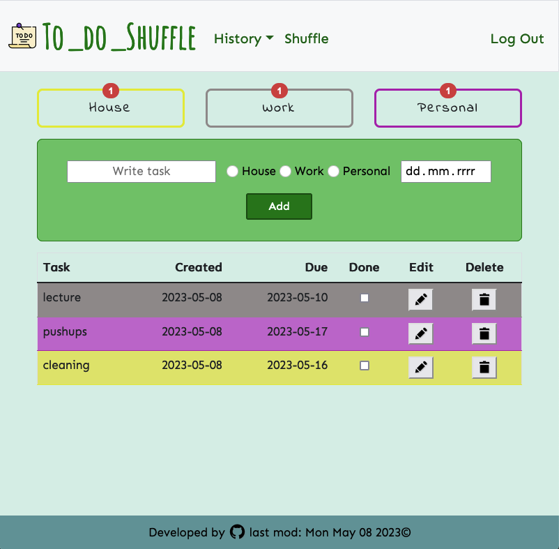

## Todo Shuffle App 

  

### About
This is my final project for the 2023 CS50 X Harvard Course :boom:
It is a full stack Python app. 
This is a simple todo task manager.
You can create, edit, delete and choose random task from the list.

The app will keep track of all your todos and organize them based on 3 categories:
-   House
-   Work
-   Personal 

Each category has its own button at the top of the page, so you can navigate between them. 
The buttons are disabled if the category is empty. 
Each button also integrates a counter system that keeps track of the number of todo(s) in each category.

The history section keeps track of all the tasks that are either done or deleted, and allows you to restore elements if needed. 
You can also clear the history if it gets too long.

The suffle section is enabled when you have at least 2 todos. You can click shuffle button to randomly choose one task from list.

You can easily modified task by clicking on edit button.

## Technologies:
#### Frontend
- Bootstrap (5)
- Css
- Javascript 
#### Backend 
- Python (3.11.2)
- Flask (2.3)
- sqlite3 (3.28.0)
#### Feature:
- using @login_required decorator (protect routes)
- use werkzeug.security library for hashing password

### Previev 

  

